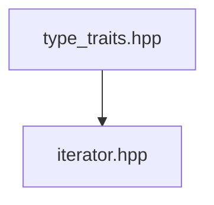

# tiny_stl

> A subset of STL, implemented in C++17, CMake, XMake, GTest and Doxygen

## 代码实现顺序 & 笔记

```mermaid
flowchart TD
type_traits.hpp --> iterator.hpp
```

### [`type_traits.hpp`](./include/type_traits.hpp)

使用`constexpr`实现编译期常量的使用
