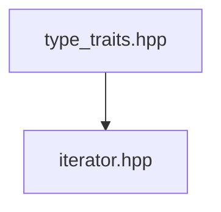

# tiny_stl

> A subset of STL, implemented in C++17, CMake, XMake, GTest and Doxygen

## 代码实现顺序 & 笔记




### [`type_traits.hpp`](./include/type_traits.hpp)

使用`constexpr`实现编译期常量的使用

### [`iterator.hpp`](./include/iterator.hpp)

1. 迭代器

    - 五种迭代器类型

    - 迭代器的特征(trait)有什么

2. 萃取器

    1. 调用顺序:

      ```mermaid
      flowchart TD
      iterator_traits --has iterator_category field--> 
      iterator_traits_helper --is derived class of input_iterator_tag or output_iterator_tag--> 
      iterator_traits_impl
      ```

      

    2. SFINAE(*Substitution Failure Is Not An Error*)

      > 如果在模板参数推断或函数重载解析中，替换（substitution）某个模板导致失败，编译器将不会报错，而是会尝试选择其他备选项

      ```cpp
      /**
       * 1. Function Template overload
       * 此处尝试在第二个模板参数的位置获取 T 实例的 some_member 成员, 如果成功, 那么模板匹配成功, 实例化模板, 否则匹配失败
       */
      template <typename T, typename = decltype(std::declval<T>().some_member)>
      void someFunction(T value) {
        // Implementation for types with 'some_member'
      }
      
      template <typename T>
      void someFunction(T value) {
        // Default implementation for types without 'some_member'
      }
      ```

      ```cpp
      /**
       * 2. Template specialization
       */
      template <typename T, typename Enable = void>
      struct MyClass {
        // Default implementation
      };
      
      /**
       * 此处测试 T 是不是可以当做整型值使用, 如果匹配成功, 则实例化模板, 否则匹配失败
       */
      template <typename T>
      struct MyClass<T, std::enable_if_t<std::is_integral<T>::value>> {
        // Specialization for integral types
      };
      ```
