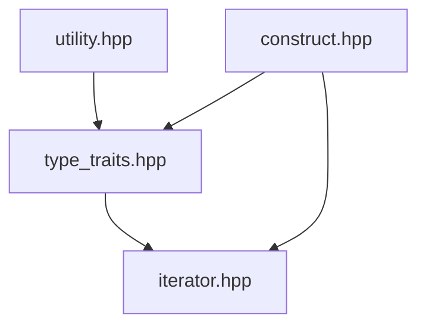
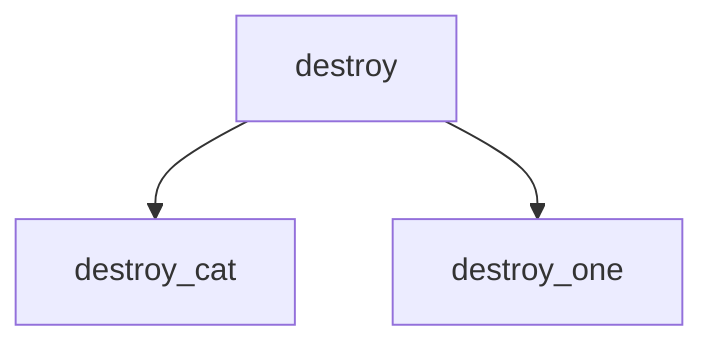

# tiny_stl

> A subset of STL, implemented in C++17, CMake, XMake, GTest and Doxygen

## 代码实现顺序 & 笔记




### [`type_traits.hpp`](./include/type_traits.hpp)

使用`constexpr`实现编译期常量的使用d

### [`iterator.hpp`](./include/iterator.hpp)

1. 迭代器

    - 五种迭代器类型

    - 迭代器的特征(trait)有什么

2. 萃取器

    1. 调用顺序:

      ```mermaid
      flowchart TD
      iterator_traits --has iterator_category field--> 
      iterator_traits_helper --is derived class of input_iterator_tag or output_iterator_tag--> 
      iterator_traits_impl
      ```

      

    2. SFINAE(*Substitution Failure Is Not An Error*)

      > 如果在模板参数推断或函数重载解析中，替换（substitution）某个模板导致失败，编译器将不会报错，而是会尝试选择其他备选项

      ```cpp
      /**
       * 1. Function Template overload
       * 此处尝试在第二个模板参数的位置获取 T 实例的 some_member 成员, 如果成功, 那么模板匹配成功, 实例化模板, 否则匹配失败
       */
      template <typename T, typename = decltype(std::declval<T>().some_member)>
      void someFunction(T value) {
        // Implementation for types with 'some_member'
      }
      
      template <typename T>
      void someFunction(T value) {
        // Default implementation for types without 'some_member'
      }
      ```

      ```cpp
      /**
       * 2. Template specialization
       */
      template <typename T, typename Enable = void>
      struct MyClass {
        // Default implementation
      };
      
      /**
       * 此处测试 T 是不是可以当做整型值使用, 如果匹配成功, 则实例化模板, 否则匹配失败
       */
      template <typename T>
      struct MyClass<T, std::enable_if_t<std::is_integral<T>::value>> {
        // Specialization for integral types
      };
      ```
3. `template <class T> struct iterator_traits<const T *>`: [为何`value_type`是`T`](https://stackoverflow.com/questions/12819405/why-is-stditerator-traitsvalue-type-non-const-even-for-a-const-iterator)
4. `template<class Iterator >reference [tiny_stl::reverse_iterator](classtiny__stl_1_1reverse__iterator.html)< Iterator >::operator*()const`: 为何取值操作先自减, 再取值: https://stackoverflow.com/a/74161268/16941344

### `utility.hpp`

1. [C++ 通用引用](https://www.cnblogs.com/ljx-null/p/15940982.html)
2. [移动语义和完美转发浅析](https://www.cnblogs.com/ljx-null/p/16512384.html)

```c++
// SFINAE 的第一种形式: 如果匹配成功, 那么第三个模板参数会为 void  
template <class U1 = T1, class U2 = T2,
            typename = typename std::enable_if_t<
                std::is_default_constructible_v<U1> &&
                    std::is_default_constructible_v<U2>,
                void>>
  constexpr pair() : first(), second() {}
```

```c++
// SFINAE 的第二种形式: 如果匹配成功, 那么第三个模板参数会被自动赋值为 0
// 此处为 0 并没有特殊含义, 只是提供一个初始值
template <
      class U1 = T1, class U2 = T2,
      typename std::enable_if_t<std::is_copy_constructible_v<U1> &&
                                    std::is_copy_constructible_v<U2> &&
                                    std::is_convertible_v<const U1 &, T1> &&
                                    std::is_convertible_v<const U2 &, T2>,
                                int> = 0>
  constexpr pair(const T1 &a, const T2 &b) : first(a), second(b) {}
```

### `construct.hpp`



> 根据一个变量是否有析构函数来决定调用的时候要不要调用析构函数: `std::is_trivially_destructible`
